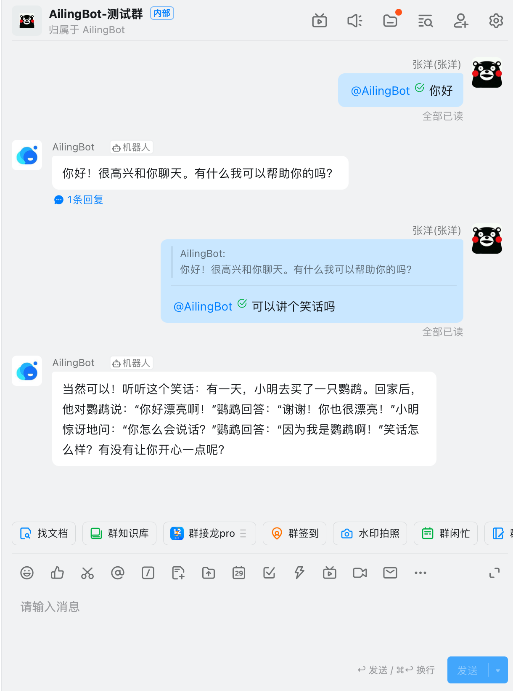

<p align="center">
  
</p>

<p align="center"><b>AilingBot - 一站式解决方案，为你的IM机器人接入AI强大能力。</b></p>

# AilingBot是什么

AilingBot是一个开源的工程开发框架，同时也是IM机器人接入AI模型的一站式解决方案。通过AilingBot你可以：

- ☕**零代码使用**：快速将现有AI大模型能力接入主流IM机器人（如企业微信、飞书、钉钉等），实现通过IM机器人与AI大模型交互以完成业务需求。目前内置了多轮对话和文档知识问答两种能力，未来将内置更多能力
- 🛠️**二次开发**：AilingBot提供了一套清晰的工程架构、接口定义和必需基础组件，无需从头开始重复开发大模型服务的工程框架，只需实现自己Chat
  Policy，并通过一些简单的配置，就能完成端到端的AI模型对IM机器人的赋能。同时也支持通过开发自己的Channel扩展到你自己的端（如自己的IM、Web应用或移动端应用）

# 特点

- 💯**开源&免费**：完全开源且免费
- 📦**开箱即用**：无需开发，预置接入现有主流IM及AI模型的能力
- 🔗**LangChain友好**：方便集成LangChain
- 🧩**模块化**：项目采用模块化组织，模块之间通过抽象协议依赖，同类模块实现协议即可即插即用
- 💻**可扩展**：可以扩展AilingBot的使用场景和能力。例如接入到新的IM，新的AI模型，或者定制自己的对话策略
- 🔥**高性能**：AilingBot采用基于协程的异步模式，提高系统的高并发性能。同时可以通过多进程进一步提升系统的高并发处理能力
- 🔌**通过API集成**：AilingBot提供一组清晰的API接口，方便与其他系统及流程集成协同

# 🚀快速开始

## 5分钟启动一个AI聊天机器人

下面将看到如何通过AilingBot快速启动一个基于命令行界面的AI机器人，效果如图：
<p align="center">
    
</p>


> 💡首先你需要有一个OpenAI API key。如果没有参考互联网上相关资料获取

### 通过Docker

```shell
git clone https://github.com/ericzhang-cn/ailingbot.git ailingbot
cd ailingbot
docker build -t ailingbot .
docker run -it --rm \
  -e  AILINGBOT_POLICY__LLM__OPENAI_API_KEY={你的OpenAI API key} \
  ailingbot poetry run ailingbot chat
```

### 通过PIP

#### 安装

```shell
pip install ailingbot
```

#### 生成配置文件

```shell
ailingbot init --silence --overwrite
```

此时在当前目录会创建一个叫settings.toml的文件，这个文件就是AilingBot的配置文件。
接下来修改必要配置，启动机器人只需一项配置，找到settings.toml中以下部分：

```toml
[policy.llm]
_type = "openai"
model_name = "gpt-3.5-turbo"
openai_api_key = ""
temperature = 0
```

将其中`openai_api_key`的值改为你的真实OpenAI API key。

#### 启动机器人

通过如下命令启动机器人：

```shell
ailingbot chat
```

## 接入企业微信

下面演示如何快速将上面的机器人接入企业微信。

### 通过Docker

```shell
git clone https://github.com/ericzhang-cn/ailingbot.git ailingbot
cd ailingbot
docker build -t ailingbot .
docker run -d \
  -e AILINGBOT_POLICY__NAME=lc_conversation \
  -e AILINGBOT_POLICY__HISTORY_SIZE=5 \
  -e AILINGBOT_POLICY__LLM__OPENAI_API_KEY={你的OpenAI API key} \
  -e AILINGBOT_CHANNEL__NAME=wechatwork \
  -e AILINGBOT_CHANNEL__CORPID={你的企业微信机器人corpid} \
  -e AILINGBOT_CHANNEL__CORPSECRET={你的企业微信机器人corpsecret} \
  -e AILINGBOT_CHANNEL__AGENTID={你的企业微信机器人agentid} \
  -e AILINGBOT_CHANNEL__TOKEN={你的企业微信机器人webhook token} \
  -e AILINGBOT_CHANNEL__AES_KEY={你的企业微信机器人webhook aes_key} \
  -p 8080:8080
  ailingbot poetry run ailingbot serve
```

### 通过PIP

#### 安装

```shell
pip install ailingbot
```

#### 生成配置文件

```shell
ailingbot init --silence --overwrite
```

#### 修改配置文件

打开`settings.toml`，将其中的下面部分填入你的企业微信应用真实信息：

```toml
[channel]
name = "wechatwork"
corpid = "" # 填写真实信息
corpsecret = "" # 填写真实信息
agentid = 0 # 填写真实信息
token = "" # 填写真实信息
aes_key = "" # 填写真实信息
```

在llm中填入你的OpenAI API Key：

```toml
[policy.llm]
_type = "openai"
model_name = "gpt-3.5-turbo"
openai_api_key = "" # 这里填入真实OpenAI API Key
temperature = 0
```

#### 启动服务

```shell
ailingbot serve
```

最后我们需要去企业微信的管理后台，将webhook地址配置好，以便企业微信知道将接收到的用户消息转发到我们的webhook。
Webhook的URL为：`http(s)://你的公网IP:8080/webhook/wechatwork/event/`

完成以上配置后，就可以在企业微信中找到机器人，进行对话了：

<p align="center">
    
</p>

## 接入飞书

下面演示如何快速将上面的机器人接入飞书，并启用一个新的对话策略：上传文档并针对文档进行知识问答。

### 通过Docker

```shell
git clone https://github.com/ericzhang-cn/ailingbot.git ailingbot
cd ailingbot
docker build -t ailingbot .
docker run -d \
  -e AILINGBOT_POLICY__NAME=lc_document_qa \
  -e AILINGBOT_POLICY__CHUNK_SIZE=1000 \
  -e AILINGBOT_POLICY__CHUNK_OVERLAP=0 \
  -e AILINGBOT_POLICY__LLM__OPENAI_API_KEY={你的OpenAI API key} \
  -e AILINGBOT_POLICY__LLM__MODEL_NAME=gpt-3.5-turbo-16k \
  -e AILINGBOT_CHANNEL__NAME=feishu \
  -e AILINGBOT_CHANNEL__APP_ID={你的飞书机器人app id} \
  -e AILINGBOT_CHANNEL__APP_SECRET={你的飞书机器人app secret} \
  -e AILINGBOT_CHANNEL__VERIFICATION_TOKEN={你的飞书机器人webhook verification token} \
  -p 8080:8080
  ailingbot poetry run ailingbot serve
```

### 通过PIP

#### 安装

```shell
pip install ailingbot
```

#### 生成配置文件

```shell
ailingbot init --silence --overwrite
```

#### 修改配置文件

打开`settings.toml`，将其中的channel部分改为如下，并填入你的飞书真实信息：

```toml
[channel]
name = "feishu"
app_id = "" # 填写真实信息
app_secret = "" # 填写真实信息
verification_token = "" # 填写真实信息
```

将policy部分替换为文档问答策略：

```toml
[policy]
name = "lc_document_qa"
chunk_size = 1000
chunk_overlap = 5
```

最后建议在使用文档问答策略时，使用16k模型，因此将`policy.llm.model_name`修改为如下配置：

```toml
[policy.llm]
_type = "openai"
model_name = "gpt-3.5-turbo-16k" # 这里改为gpt-3.5-turbo-16k
openai_api_key = "" # 填写真实信息
temperature = 0
```

#### 启动服务

```shell
ailingbot serve
```

最后我们需要去飞书的管理后台，将webhook地址配置好。
飞书Webhook的URL为：`http(s)://你的公网IP:8080/webhook/feishu/event/`

完成以上配置后，就可以在飞书中找到机器人，进行对话了：

<p align="center">
    
</p>

## 接入钉钉

下面演示如何快速将上面的机器人接入钉钉。

### 通过Docker

```shell
git clone https://github.com/ericzhang-cn/ailingbot.git ailingbot
cd ailingbot
docker build -t ailingbot .
docker run -d \
  -e AILINGBOT_POLICY__NAME=lc_conversation \
  -e AILINGBOT_POLICY__HISTORY_SIZE=5 \
  -e AILINGBOT_POLICY__LLM__OPENAI_API_KEY={你的OpenAI API key} \
  -e AILINGBOT_CHANNEL__NAME=dingtalk \
  -e AILINGBOT_CHANNEL__APP_KEY={你的钉钉机器人app key} \
  -e AILINGBOT_CHANNEL__APP_SECRET={你的钉钉机器人app secret} \
  -e AILINGBOT_CHANNEL__ROBOT_CODE={你的钉钉机器人robot code} \
  -p 8080:8080
  ailingbot poetry run ailingbot serve
```

### 通过PIP

#### 安装

```shell
pip install ailingbot
```

#### 生成配置文件

```shell
ailingbot init --silence --overwrite
```

#### 修改配置文件

打开`settings.toml`，将其中的channel部分改为如下，并填入你的飞书真实信息：

```toml
[channel]
name = "dingtalk"
app_key = "" # 填写真实信息
app_secret = "" # 填写真实信息
robot_code = "" # 填写真实信息
```

#### 启动服务

```shell
ailingbot serve
```

最后我们需要去钉钉的管理后台，将webhook地址配置好。
钉钉Webhook的URL为：`http(s)://你的公网IP:8080/webhook/dingtalk/event/`

完成以上配置后，就可以在钉钉中找到机器人，进行对话了：

<p align="center">
    
</p>

# 📖使用指南

## 主要流程

AilingBot的主要处理流程如下图：

<p align="center">
    
</p>

1. 首先用户将消息发送给IM的机器人
2. 如果配置了webhook，即时通讯工具会将发送给机器人的请求转发到webhook服务地址
3. Webhook服务将IM原始消息经过处理，转为AilingBot内部的消息格式，发送给ChatBot
4. ChatBot会根据所配置的会话策略（Chat Policy），处理请求并形成响应消息。这个过程中，ChatBot
   可能会进行请求大语言模型、访问向量数据库、调用外部API等操作以完成请求处理
5. ChatBot将响应信息发送给IM Agent，IM Agent负责将AilingBot内部响应信息格式转换成
   特定IM的格式，并调用IM开放能力API发送响应消息
6. IM机器人将消息显示给用户，完成整个处理过程

## 主要概念

- **IM机器人**：多数即时通讯工具内置的能力，允许管理员创建一个机器人，并通过程序处理用户的消息
- **Channel**：Channel表示不同终端，可以是一个IM，也可能是一个自定义终端（如Web）
- **Webhook**：一个http(s)服务，用于接收IM机器人转发的用户消息，不同Channel对于webhook有自己的规范，因此需要有自己的webhook实现
- **IM Agent**：用于调用IM开放能力API，不同的IM开放能力API不同，因此每个Channel需要有对应Agent实现
- **ChatBot**：用于接收和响应用户消息的核心组件
- **会话策略**：具体定义如何响应用户，被ChatBot调用。一个会话策略具体定义了机器人的能力，如闲聊、进行知识问答等
- **LLM**：大语言模型，如何OpenAI的ChatGPT，开放的ChatGLM等均属于不同的大语言模型，大语言模型是实现AI能力的关键组件

## 配置

### 配置方式

AilingBot的配置可以通过两种方式：

- **通过配置文件**：AilingBot读取当前目录的`settings.toml`作为配置文件，其文件格式为[TOML](https://toml.io/en/)
  具体配置项见下文
- **通过环境变量**：AilingBot也会读取环境变量中配置项，具体环境变量列表见下文

> 💡配置文件和环境变量可以混合使用，当一个配置项同时存在于两者时，优先使用环境变量

### 配置映射关系

所有配置，TOML配置键和环境变量有如下映射关系：

- 所有环境变量以`AILINGBOT_`开头
- 层级之间用两个下划线`__`隔开
- 配置键内部的下划线在环境变量中保留
- 不区分大小写

例如：

- `some_conf`的对应环境变量为`AILINGBOT_SOME_CONF`
- `some_conf.conf_1`的对应环境变量为`AILINGBOT_SOME_CONF__CONF_1`
- `some_conf.conf_1.subconf`的对应环境变量为`AILINGBOT_SOME_CONF__CONF_1__SUBCONF`

### 配置项

#### 通用

| 配置项       | 说明                                                                                     | TOML                 | 环境变量                            |
|-----------|----------------------------------------------------------------------------------------|----------------------|---------------------------------|
| 语言        | 语言码（参考：http://www.lingoes.net/en/translator/langcode.htm）                              | lang                 | AILINGBOT_LANG                  |
| 时区        | 时区码（参考：https://en.wikipedia.org/wiki/List_of_tz_database_time_zones                    | tz                   | AILINGBOT_TZ                    |
| 会话策略名称    | 预置会话策略名称或完整会话策略class路径                                                                 | policy.name          | AILINGBOT_POLICY__NAME          |
| Channel名称 | 预置Channel名称                                                                            | channel.name         | AILINGBOT_CHANNEL__NAME         |
| Webhook路径 | 非预置Channel webhook的完整class路径                                                           | channel.webhook_name | AILINGBOT_CHANNEL__WEBHOOK_NAME |
| Agent路径   | 非预置Channel agent的完整class路径                                                             | channel.agent_name   | AILINGBOT_CHANNEL__AGENT_NAME   |
| Uvicorn配置 | 所有uvicorn配置（参考：[uvicorn settings](https://www.uvicorn.org/settings/)），这部分配置会透传给uvicorn | uvicorn.*            | AILINGBOT_CHANNEL__UVICORN__*   |

配置示例：

```toml
lang = "zh_CN"
tz = "Asia/Shanghai"

[policy]
name = "lc_conversation"
# 更多policy配置

[policy.llm]
# 模型配置

[channel]
name = "wechatwork"
# 更多channel配置

[uvicorn]
host = "0.0.0.0"
port = 8080
```

#### 内置会话策略配置

##### lc_conversation

lc_conversation使用LangChain的Conversation作为会话策略，其效果为直接和LLM对话，且带有对话历史上下文，因此可以进行多轮会话。

| 配置项    | 说明          | TOML                | 环境变量                           |
|--------|-------------|---------------------|--------------------------------|
| 会话历史长度 | 表示保留多少轮历史会话 | policy.history_size | AILINGBOT_POLICY__HISTORY_SIZE |

配置示例：

```toml
# 使用lc_conversation策略，保留5轮历史会话
[policy]
name = "lc_conversation"
history_size = 5
```

##### lc_document_qa

lc_document_qa使用LangChain的[Stuff](https://python.langchain.com/docs/modules/chains/document/stuff)作为对话策略。
用户可上传一个文档，然后针对文档内容进行提问。

| 配置项     | 说明                                 | TOML                 | 环境变量                            |
|---------|------------------------------------|----------------------|---------------------------------|
| 文档切分块大小 | 对应LangChain Splitter的chunk_size    | policy.chunk_size    | AILINGBOT_POLICY__CHUNK_SIZE    |
| 文档切重叠   | 对应LangChain Splitter的chunk_overlap | policy.chunk_overlap | AILINGBOT_POLICY__CHUNK_OVERLAP |

配置示例：

```toml
# 使用lc_document_qa策略，chunk_size和chunk_overlap分别配置为1000和0
[policy]
name = "lc_conversation"
chunk_size = 1000
chunk_overlap = 0
```

#### 模型配置

模型配置与LangChain保持一致，下面给出示例。

##### OpenAI

```toml
[policy.llm]
_type = "openai" # 对应环境变量AILINGBOT_POLICY__LLM___TYPE
model_name = "gpt-3.5-turbo" # 对应环境变量AILINGBOT_POLICY__LLM__MODEL_NAME
openai_api_key = "sk-pd8******************************HQQS241dNrHH1kv" # 对应环境变量AILINGBOT_POLICY__LLM__OPENAI_API_KEY
temperature = 0 # 对应环境变量AILINGBOT_POLICY__LLM__TEMPERATURE
```

#### 内置Channel配置

##### 企业微信

| 配置项         | 说明                        | TOML               | 环境变量                          |
|-------------|---------------------------|--------------------|-------------------------------|
| Corp ID     | 企业微信自建app的corpid          | channel.corpid     | AILINGBOT_CHANNEL__CORPID     |
| Corp Secret | 企业微信自建app的corpsecret      | channel.corpsecret | AILINGBOT_CHANNEL__CORPSECRET |
| Agent ID    | 企业微信自建app的agentid         | channel.agentid    | AILINGBOT_CHANNEL__AGENTID    |
| TOKEN       | 企业微信自建app的webhook token   | channel.token      | AILINGBOT_CHANNEL__TOKEN      |
| AES KEY     | 企业微信自建app的webhook aes key | channel.aes_key    | AILINGBOT_CHANNEL__AES_KEY    |

配置示例：

```toml
[channel]
name = "wechatwork"
corpid = "wwb**********ddb40"
corpsecret = "TG3t******************************hZslJNe5Q"
agentid = 1000001
token = "j9SK**********zLeJdFSYh"
aes_key = "7gCwzwH******************************p1p0O8"
```

##### 飞书

| 配置项                | 说明                                | TOML                       | 环境变量                                  |
|--------------------|-----------------------------------|----------------------------|---------------------------------------|
| App ID             | 飞书自建应用的app id                     | channel.app_id             | AILINGBOT_CHANNEL__APP_ID             |
| App Secret         | 飞书自建应用的app secret                 | channel.app_secret         | AILINGBOT_CHANNEL__APP_SECRET         |
| Verification Token | 飞书自建应用的webhook verification token | channel.verification_token | AILINGBOT_CHANNEL__VERIFICATION_TOKEN |

配置示例：

```toml
[channel]
name = "feishu"
app_id = "cli_a**********9d00e"
app_secret = "y********************cyk8AxmYVDD"
verification_token = "yIJ********************7bfNHUcYH"
```

##### 钉钉

| 配置项        | 说明                | TOML               | 环境变量                          |
|------------|-------------------|--------------------|-------------------------------|
| App Key    | 钉钉自建应用的app key    | channel.app_key    | AILINGBOT_CHANNEL__APP_KEY    |
| App Secret | 钉钉自建应用的app secret | channel.app_secret | AILINGBOT_CHANNEL__APP_SECRET |
| Robot Code | 钉钉自建应用的robot code | channel.robot_code | AILINGBOT_CHANNEL__ROBOT_CODE |

配置示例：

```toml
[channel]
name = "dingtalk"
app_key = "dingi**********wymdr"
app_secret = "ombrcUp****************************************GL2AwObLjILUY1MzD"
robot_code = "ding**********owymdr"
```

## 命令行工具

### 初始化配置文件（init）

#### 使用方法

`init`命令将在当前目录生成配置文件settings.toml。默认情况下，将以交互方式询问用户，
可以使用`--silence`让生成过程不询问用户，直接使用默认配置。

```text
Usage: ailingbot init [OPTIONS]

  Initialize the AilingBot environment.

Options:
  --silence    Without asking the user.
  --overwrite  Overwrite existing file if a file with the same name already
               exists.
  --help       Show this message and exit.
```

#### Options

| Option      | 说明                     | 类型   | 备注 |
|-------------|------------------------|------|----|
| --silence   | 不询问用户，直接生成默认配置         | Flag |    |
| --overwrite | 允许覆盖当前目录的settings.toml | Flag |    |

### 查看当前配置（config）

`config`命令将读取当前环境的配置（包括配置文件及环境变量配置，并进行合并）。

#### 使用方法

```text
Usage: ailingbot config [OPTIONS]

  Show current configuration information.

Options:
  -k, --config-key TEXT  Configuration key.
  --help                 Show this message and exit.
```

#### Options

| Option           | 说明  | 类型     | 备注             |
|------------------|-----|--------|----------------|
| -k, --config-key | 配置键 | String | 不传入的话，显示完整配置信息 |

### 启动命令行机器人（chat）

`chat`命令启动一个交互式命令行机器人，用于测试当前chat policy。

#### 使用方法

```text
Usage: ailingbot chat [OPTIONS]

  Start an interactive bot conversation environment.

Options:
  --debug  Enable debug mode.
  --help   Show this message and exit.
```

#### Options

| Option  | 说明        | 类型   | 备注                     |
|---------|-----------|------|------------------------|
| --debug | 开启debug模式 | Flag | Debug模式将输出更多内容，如prompt |

### 启动Webhook服务（serve）

`serve`命令启动Webhook HTTP server，用于真正实现和具体IM进行交互。

#### 使用方法

```text
Usage: ailingbot serve [OPTIONS]

  Run webhook server to receive events.

Options:
  --log-level [TRACE|DEBUG|INFO|SUCCESS|WARNING|ERROR|CRITICAL]
                                  The minimum severity level from which logged
                                  messages should be sent to(read from
                                  environment variable AILINGBOT_LOG_LEVEL if
                                  is not passed into).  [default: TRACE]
  --log-file TEXT                 STDOUT, STDERR, or file path(read from
                                  environment variable AILINGBOT_LOG_FILE if
                                  is not passed into).  [default: STDERR]
  --help                          Show this message and exit.
```

#### Options

| Option      | 说明                  | 类型     | 备注                    |
|-------------|---------------------|--------|-----------------------|
| --log-level | 显示日志级别，将显示此级别及以上的日志 | String | 默认显示所有级别（TRACE）       |
| --log-file  | 日志输出位置              | String | 默认情况日志打印到标准错误（STDERR） |

# 💻开发指南

## 开发总则

TBD

## 开发对话策略

TBD

## 开发Channel

TBD

# 发展计划

- [ ] 提供完善的使用文档和开发者文档
- [ ] 支持更多的Channel
    - [x] 企业微信
    - [x] 飞书
    - [x] 钉钉
    - [ ] Slack
- [ ] 开发更多的开箱即用的对话策略
    - [x] 多轮会话策略
    - [ ] 文档问答策略
    - [ ] 数据库问答策略
    - [ ] 在线搜索问答策略
- [ ] 基础组件抽象
    - [ ] 大语言模型
    - [ ] 知识库
- [ ] 支持本地模型部署
    - [ ] ChatGLM-6B
- [ ] 支持通过API调用
- [ ] Web管理后台及可视化配置管理
- [x] 提供基于Docker容器的部署能力
- [ ] 增强系统的可观测性和可治理性
- [ ] 完善的测试用例
