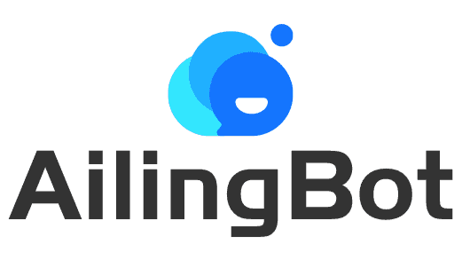
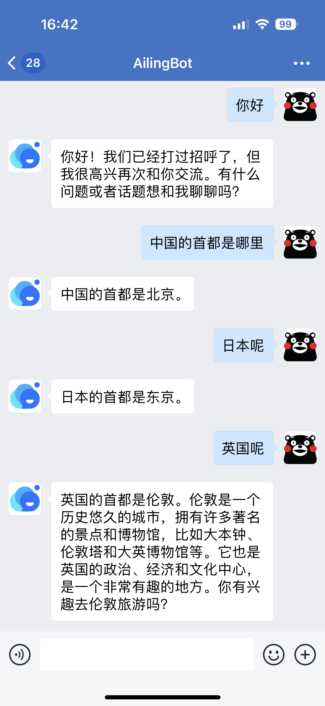

<p align="center">
  
</p>

<p style="text-align: center"><b>AilingBot - 一站式解决方案，为你的IM机器人接入AI强大能力。</b></p>

# 特点

- 💯**开源&免费**：完全开源且免费
- 📦**开箱即用**：无需开发，预置接入现有主流IM及AI模型的能力
- 🔗**LangChain友好**：方便集成LangChain
- 🧩**模块化**：项目采用模块化组织，模块之间通过抽象协议依赖，同类模块实现协议即可即插即用
- 💻**可扩展**：可以扩展AilingBot的使用场景和能力。例如接入到新的IM，新的AI模型，或者定制自己的对话策略
- 🚀**高性能**：AilingBot采用基于协程的异步模式，提高系统的高并发性能。同时可以通过多进程进一步提升系统的高并发处理能力
- 🔌**通过API集成**：AilingBot提供一组清晰的API接口，方便与其他系统及流程集成协同

# IM支持列表

## 已支持

- 企业微信
- 飞书

## 即将支持

- 钉钉
- Slack

# 快速使用指南

## 5分钟启动一个AI聊天机器人

下面将看到如何通过AilingBot快速启动一个基于命令行界面的AI机器人，效果如图：
<p align="center">
    
</p>


> 💡首先你需要有一个OpenAI API key。如果没有请到这里申请：https://platform.openai.com/account/api-keys

### 通过Docker

```shell
git clone https://github.com/ericzhang-cn/ailingbot.git ailingbot
cd ailingbot
docker build -t ailingbot .
docker run -it --rm \
  -e  AILINGBOT_POLICY__LLM__OPENAI_API_KEY={你的OpenAI API key} \
  ailingbot poetry run ailingbot chat
```

### 通过PIP

#### 安装

```shell
pip install ailingbot
```

#### 生成配置文件

```shell
ailingbot init --silence --overwrite
```

此时在当前目录会创建一个叫settings.toml的文件，这个文件就是AilingBot的配置文件。
接下来修改必要配置，启动机器人只需一项配置，找到settings.toml中以下部分：

```toml
[policy.llm]
_type = "openai"
model_name = "gpt-3.5-turbo"
openai_api_key = ""
temperature = 0
```

将其中`openai_api_key`的值改为你的真实OpenAI API key。

#### 启动机器人

通过如下命令启动机器人：

```shell
ailingbot chat
```

## 接入即时通讯工具

下面演示如何快速将上面的机器人接入企业微信。

### 通过Docker

```shell
git clone https://github.com/ericzhang-cn/ailingbot.git ailingbot
cd ailingbot
docker build -t ailingbot .
docker run -it --rm \
  -e AILINGBOT_POLICY__LLM__OPENAI_API_KEY={你的OpenAI API key} \
  -e AILINGBOT_CHANNEL__CORPID={你的企业微信corpid} \
  -e AILINGBOT_CHANNEL__CORPSECRET={你的企业微信corpsecret} \
  -e AILINGBOT_CHANNEL__AGENTID={你的企业微信agentid} \
  -e AILINGBOT_CHANNEL__TOEKN={你的企业微信webhook token} \
  -e AILINGBOT_CHANNEL__AES_KEY={你的企业微信webhook aes_key} \
  ailingbot poetry run ailingbot serve
```

### 通过PIP

#### 安装

```shell
pip install ailingbot
```

#### 生成配置文件

```shell
ailingbot init --silence --overwrite
```

#### 修改配置文件

打开`settings.toml`，将其中的下面部分填入你的企业微信应用真实信息：

```toml
[channel]
name = "wechatwork"
corpid = ""
corpsecret = ""
agentid = 0
token = ""
aes_key = ""
```

#### 启动服务

```shell
ailingbot serve
```

最后我们需要去企业微信的管理后台，将webhook地址配置好，以便企业微信知道将接收到的用户消息转发到我们的webhook。
Webhook的URL为：`http(s)://你的公网IP:8080/webhook/wechatwork/event/`

完成以上配置后，就可以在企业微信中找到机器人，进行对话了：

<p align="center">
    
</p>

# 发展计划

- [ ] 提供完善的使用文档和开发者文档
- [ ] 支持更多的IM端，如钉钉、Slack等
- [ ] 支持更多常用LLM prompting范式和开箱即用的对话策略
- [ ] 对LLM Chain中的常用能力，如对Vector Embedding&Query和Grounding提供支持
- [ ] 提供WebUI
- [ ] 提供基于Docker容器的一键部署能力
- [ ] 增强系统的可观测性和可治理性
