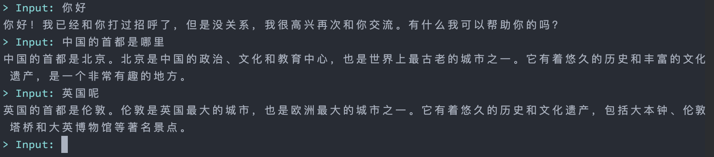
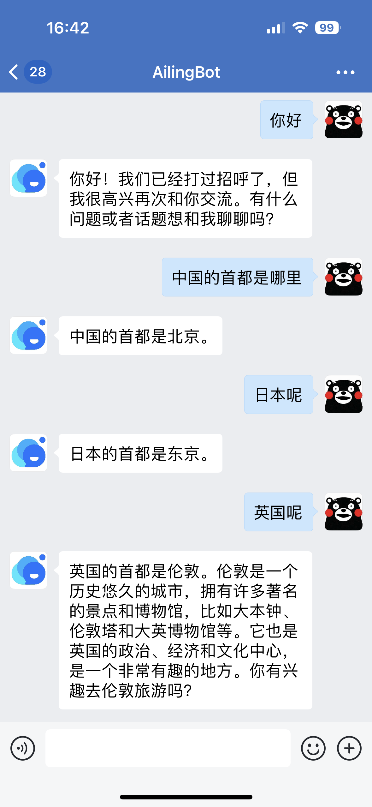

[🇬🇧English](https://github.com/ericzhang-cn/ailingbot/blob/main/README.md)

---


AilingBot - 一站式解决方案，为你的IM机器人接入AI强大能力。

# 特点

- 💯**开源&免费**：完全开源且免费
- 📦**开箱即用**：无需开发，预置接入现有主流IM及LLM模型的能力
- 🔗**集成LangChain**：集成LangChain的能力，可以直接使用LangChain预置的Chain或Agent
- 🧩**模块化**：项目采用模块化组织，模块之间通过抽象协议依赖，同类模块实现协议即可即插即用
- 💻**可扩展**：可以扩展AilingBot的使用场景和能力。例如接入到新的IM，新的LLM，或者开发自己的Chain、Agent及对话策略
- 🚀**高性能**：AilingBot采用基于协程的异步模式，提高系统的高并发性能。同时核心进程
  可以启动多进程，进一步提升系统的高并发处理能力
- 🔌**API**：AilingBot提供一组清晰的Endpoint作为其API接口，方便与其他系统及
  流程集成协同

# 快速使用指南

## 5分钟启动一个AI聊天机器人

### 前置条件

请确保你的机器上装有如下环境：

- Python（>=3.9）：https://www.python.org/
- Poetry：https://python-poetry.org/

同时你需要有一个OpenAI API key。如果没有请到这里申请：https://platform.openai.com/account/api-keys

### 修改配置文件

复制配置文件模板并重命名：

```shell
cp settings.example.toml settings.toml
```

修改必要配置，启动机器人只需一项配置，找到settings.toml中以下部分：

```toml
[policy.args.lc_chain_config.llm]
_type = "openai"
model_name = "gpt-3.5-turbo"
openai_api_key = "Your OpenAI API key"
temperature = 0
```

将其中`openai_api_key`的值改为你的真实OpenAI API key。

### 启动机器人

在AilingBot根目录下，首先安装依赖：

```shell
poetry install
```

然后进入virtualenv环境：

```shell
poetry shell
```

执行以下命令：

```shell
ailingbot --help
```

如果能看到以下输出，则说明AilingBot安装成功：

```text
Usage: ailingbot [OPTIONS] COMMAND [ARGS]...

  AilingBot command line tools.

Options:
  --help  Show this message and exit.

Commands:
  bot      Bot commands.
  channel  Channel commands.
```

通过如下命令启动机器人：

```shell
ailingbot bot chat -c settings.toml
```

此时你可以通过一个交互式对话环境与机器人进行对话，如下图所示：


## 接入即时通讯工具

下面以企业微信为例，演示AilingBot如何快速接入即时通讯工具。

### 前置条件

要接入企业微信，除了上面的前置条件外，还需要安装以下环境：

- RabbitMQ：https://www.rabbitmq.com/
- 同时假设你已经有了一个可用的企业微信应用，并熟悉企业微信应用开发流程。如果对这块不熟悉，请参考企业微信官方开发者文档：
  https://developer.work.weixin.qq.com/

### 修改配置文件

打开settings.toml，其完整内容如下：

```toml
# This is the AilingBot configuration file template. Please modify it as needed.

lang = "zh_CN"
tz = "Asia/Shanghai"

[broker]
name = "pika"

[broker.args]
host = "localhost"

[policy]
name = "lc_conversation_chain"
# name = "lc_llm_chain"

[policy.args]

[policy.args.lc_chain_config]
_type = "llm_chain"

[policy.args.lc_chain_config.prompt]
_type = "prompt"
template = """Human: {input}

AI:
"""
input_variables = ["input"]

[policy.args.lc_chain_config.llm]
_type = "openai"
model_name = "gpt-3.5-turbo"
openai_api_key = "Your OpenAI API key"
temperature = 0

[channel]

[channel.agent]

name = "wechatwork"

[channel.agent.args]
corpid = "WechatWork corpid"
corpsecret = "WechatWork corpsecret"
agentid = 0

[channel.webhook]
name = "wechatwork"

[channel.webhook.args]
token = "WechatWork webhook token"
aes_key = "WechatWork webhook aes_key"

[channel.uvicorn.args]
host = "0.0.0.0"
port = 8080
```

这里有如下地方需要按需填入：

- `openai_api_key = "Your OpenAI API key"`
- `corpid = "WechatWork corpid"`
- `corpsecret = "WechatWork corpsecret"`
- `agentid = 0`
- `token = "WechatWork webhook token"`
- `aes_key = "WechatWork webhook aes_key"`

### 启动机器人

为了实现接入即时通讯工具，需要分别执行一下三个命令启动对应进程：

启动Channel Webhook进程，这个进程的作用是作为Webhook接收用户发送给企业微信应用的消息：

```shell
ailingbot channel serve_webhook -c settings.toml
```

启动Bot Serve进程，这个进程的作用是监听通过Webhook接收到的用户消息，并按对应会话策略生成回复消息：

```shell
ailingbot bot serve -c settings.toml
```

启动Channel Agent进程，这个进程的作用是将Bot Serve进程回复的消息发送给用户：

```shell
ailingbot channel serve_agent -c settings.toml
```

### 配置Webhook

最后我们需要去企业微信的管理后台，将webhook地址配置好，以便企业微信知道将接收到的用户消息转发到我们的webhook。
Webhook的URL为：`http(s)://你的公网IP:8080/webhook/wechatwork/event/`

完成以上配置后，就可以在企业微信中找到机器人，进行对话了：



# 发展计划

- [ ] 提供完善的使用文档和开发者文档
- [ ] 支持更多的IM端，如钉钉、飞书、Slack等
- [ ] 支持更多常用LLM prompting范式和开箱即用的对话策略
- [ ] 对LLM Chain中的常用能力，如对Vector Embedding&Query和Grounding提供支持
- [ ] 提供WebUI
- [ ] 提供基于Docker容器的一键部署能力
- [ ] 增强系统的可观测性和可治理性

# 许可协议

> MIT License
>
>Copyright (c) 2023 AilingBot
>
>Permission is hereby granted, free of charge, to any person obtaining a copy
> of this software and associated documentation files (the "Software"), to deal
> in the Software without restriction, including without limitation the rights
> to use, copy, modify, merge, publish, distribute, sublicense, and/or sell
> copies of the Software, and to permit persons to whom the Software is
> furnished to do so, subject to the following conditions:
>
>The above copyright notice and this permission notice shall be included in all
> copies or substantial portions of the Software.
>
>THE SOFTWARE IS PROVIDED "AS IS", WITHOUT WARRANTY OF ANY KIND, EXPRESS OR
> IMPLIED, INCLUDING BUT NOT LIMITED TO THE WARRANTIES OF MERCHANTABILITY,
> FITNESS FOR A PARTICULAR PURPOSE AND NONINFRINGEMENT. IN NO EVENT SHALL THE
> AUTHORS OR COPYRIGHT HOLDERS BE LIABLE FOR ANY CLAIM, DAMAGES OR OTHER
> LIABILITY, WHETHER IN AN ACTION OF CONTRACT, TORT OR OTHERWISE, ARISING FROM,
> OUT OF OR IN CONNECTION WITH THE SOFTWARE OR THE USE OR OTHER DEALINGS IN THE
> SOFTWARE.
